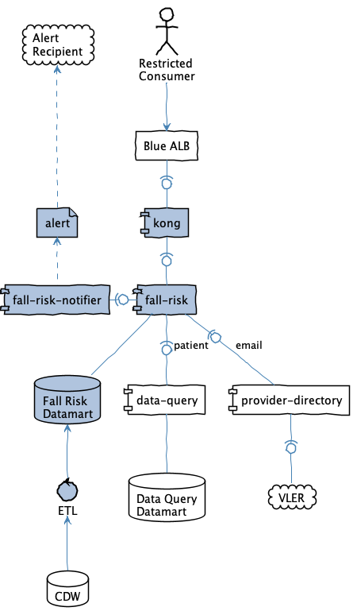

# health-apis-fall-risk

This proof of concept application to enable medical care provides with a Fall Risk Score for patients.

> ⚠️ This is a preliminary design and implementation. Data, system interaction are subject to change.

### Personas
#### Clinician

A doctor having direct contact with and responsibility for patients and who is responsible for patient care and discharge.

### Goals
- Do provide clinicians with an alert of patients that are at risk of falling
- Do include patients from one test site (Palo Alto)
- Do include patients admitted for in-patient procedures or stays
- Do not include patients admitted for out-patient procedures or stays
- Do send alerts via email to clinicians

 
### Limitations
- Using CDW as a data source will create a latency of at-least 24 hours
- Web sites or dashboards may require approval by the VA with regards to security and/or 508 compliance which may not be feasible or desirable for a PoC
- To protect PII/PHI, the PoC application will be configured with a white-list of acceptable test patients
- The PoC application will have simple token protected access (no OAuth integration)
- It’s possible that target caregiver cannot be determined for notification, e.g email missing, in which **ACTION WHEN NO EMAIL IS AVAILABLE** will be done

 
---

### `kong`
- Provides token access restriction to fall-risk

### `fall-risk`
- Provides an API for accessing Fall Risk data
  - `/fall-risk?patient=<icn>` 
    Provide data for a specific patient
  - `/fall-risk?facility=<id>&since=<datetime>`
    Provide data for all patients that have been added or modified since the given time for a specific facility
- Does not contain alerting logica
- Does contain patient white list
- Interacts with Fall Risk Datamart to discover fall risk records and for each record
- Patient details will be extracted from data-query
- Provider contact information will be extracted from provider-directory
> ⚠️ Endpoint data is required for email contact information and must be searched by name 

### `fall-risk-notifier`
- Batch application that will periodically process that will query fall-risk for facility level data and send notifications
- Responsible for notification delivery via email

### `Fall Risk Datamart` (powered by ETL  and CDW)
- Datamart-style database populated with Fall Risk data
- ETL process extracts necessary information from CDW and populates records in the Fall Risk Datamart tables

 
---

### Fall Risk Data
- Patient ICN
- Facility ID
- Time Created/Modified
- Fall Risk Score
- Provider NPI and/or name

> ⚠️ Provider name is required to search provider-directory if not available, the NPI could be used to search name from the National Provider Directory API (not pictured in diagram) 

> ⚠️ If CDW does not contain a precomputed fall risk score, the datamart record should contain individual survey question scores and the fall-risk application can provide business logic to determine overall score and risk factor, i.e. low, moderate, or high 

 